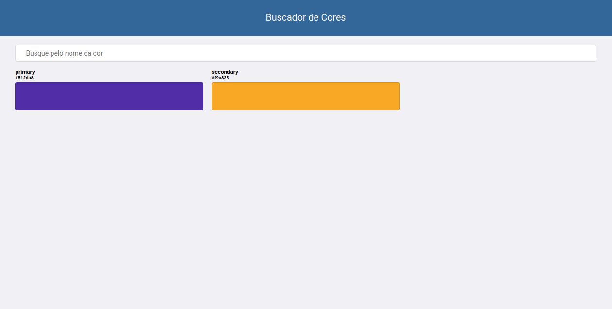
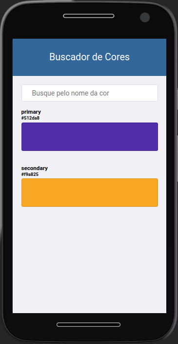

# training-react-api-search

O objetivo dessa aplicacao é aprender a criar uma aplicacao react que liste todos os items retornados de uma api REST, criando um componente para visualizacao das informacoes e tambem usando o conceito de estado para aplicar um filtro nessa lista, para que assim o usuario possa buscar determinado item que queira.

## Introdução ao React.js

- [O que é](https://pt-br.reactjs.org/)
- [Pensando do jeito React](https://pt-br.reactjs.org/docs/thinking-in-react.html)

## Criando a aplicação com react

Use o comando `npx create-react-app react-api-search` para criar um novo projeto chamado `react-api-search`

entre na pasta criada `cd react-api-search`

e rode o comando start para ver a aplicação de exemplo `npm start`

Por padrão a aplicação irá subir na porta 3000 do localhost

Mais informacoes: https://reactjs.org/docs/create-a-new-react-app.html

## Customizando a aplicação

O create-react-app já cria o projeto sugerindo uma organização padrão juntamento com um exemplo, vamos
entender a estrutura e alterar para construir nosso projeto

- `package.json`: nesse arquivo estarão algumas informações sobre o nosso projeto como nome e versão, as dependências dele e scripts para nos auxiliar a executar comandos na aplicação, como o `npm start` que acabamos de usar
- `package-lock.json`: contem uma arvore com as versoes das dependencias do projeto, é usado para garantir que todos os desenvolvedores estarao usando as mesmas versoes em suas maquinas
- `/src`: nessa pasta estao todos os arquivos do codigo que iremos escrever para criar nosssa aplicação
    - `App.css`: arquivo que aplica os estilos ao App
    - `App.js`: aqui esta o codigo principal da aplicao onde tem as informacoes que estao aparecendo na tela
    - `App.test.js`: esse é o arquivo de teste unitário do app.js
    - `index.css`: estilo do index.js
    - `index.js`: arquivo responsavel por adicionar as configuracoes necessarias para aplicação, é nele que escolhemos onde iremos adicionar o codigo react atravez do comando render passando o elemento root:
    ```ReactDOM.render(
        <React.StrictMode>
            <App />
        </React.StrictMode>,
        document.getElementById('root')
        );```
- `public`: aqui estao os arquivos que acessamos no site localhost:3000, como o index.html (que contem o id root onde sera inserido o codigo react), imagens e fonts
- `node_modules`: todas as dependencias externas que necessitamos para nossa aplicação (a lib do react esta ai dentro)

Agora que sabemos que as informações apresentadas no site estão no App.js vamos altera-lo para começar a construir nossa aplicação de busca, implementando os critérios de aceite.

## Critérios de aceite

- Deve apresentar um campo de busca na página inicial
- A página inicial já deve vir com todos os tokens de cores carregados
- O input de busca deve filtrar os tokens conforme o usuário digita
- Deve ser apresentada uma mensagem de erro quando ocorrer uma falha na busca
- Quando não encontrar nenhum token na busca dos tokens deve exibir uma mensagem de vazio

## Protótipo

Deve ter um layout responsivo para resoluções menores, conforme os protótipos abaixo:

### Desktop


### Mobile


## Criando a API

Use o https://designer.mocky.io/ para criar uma rota que retorne os tokens de cores do nosso Design System, conforme o exemplo: 

```
[{"name":"primary","color":"#512da8"},{"name":"secondary","color":"#f9a825"}]
```

Exemplo: https://run.mocky.io/v3/1497dad2-3f2f-4b7b-a778-34a9f5d9565c

